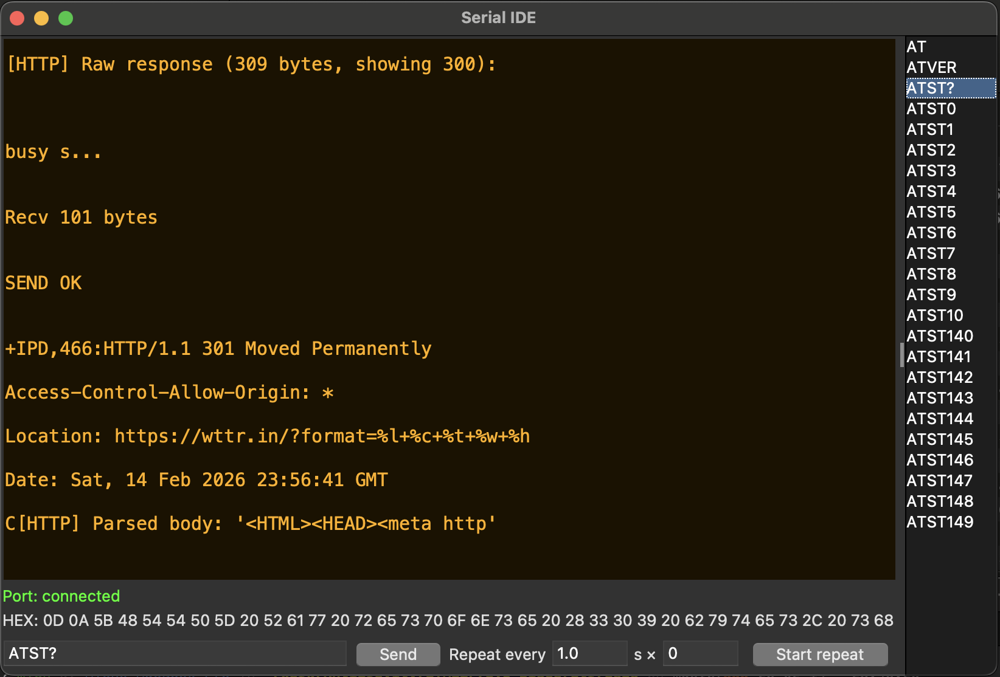

# USB Serial IDE

Мощный, но очень лёгкий терминал для инженеров. Специально заточен под ежедневную работу с UART, STM32, ESP, nRF и т.д.



## Возможности

- Горячие клавиши для всего
- Быстрый список команд (один клик = отправить)
- Повтор отправки с настраиваемым интервалом и количеством повторений
- Автосохранение лога с красивым именем
- Профили (сохраняются все настройки + команды)
- Полная устойчивость к отваливанию USB-порта
- Тёмные/светлые темы
- Виртуальный режим для отладки

## Горячие клавиши

| Клавиша                    | Действие                                       |
|----------------------------|------------------------------------------------|
| **Ctrl + X**               | Выход из программы                             |
| **Ctrl + C**               | Очистить терминал и буфер                      |
| **Ctrl + S**               | Сохранить лог (`YYYY-MM-DD_HH-MM-SS_term.txt`) |
|                            | автоматически копируется в буфер обмена системы|
| **Ctrl + F**               | Сохранить профиль по умолчанию                 |
| **Ctrl + H**               | Показать справку                               |
| **Esc**                    | Вернуться из справки обратно в лог             |
| **Enter**                  | Отправить команду                              |
| **Клик по строке справа**  | Отправить + скопировать в поле ввода           |
| **Двойной клик по строке** | Редактировать команду                          |
| **Клик по HEX**            | Скопировать hex-строку в буфер обмена          |

При нажатии **Ctrl + S** теперь лог не только сохраняется в файл, 
но и **автоматически копируется в буфер обмена** системы.  
Можно сразу вставить его (Cmd+V / Ctrl+V) в любой редактор, чат, заметки и т.д.

## Установка и запуск

```bash
git clone https://github.com/твой_ник/usbs-serial-ide.git
cd usbs-serial-ide
pip install -r requirements.txt
python usbs_term.py

## Dependencies

- Python 3.8+
- pyserial (`pip install pyserial`)

tkinter обычно уже установлен вместе с Python.  
Если нет — установите пакет `python3-tk` / `python-tk` (Linux) или `python-tk` через brew (macOS).

