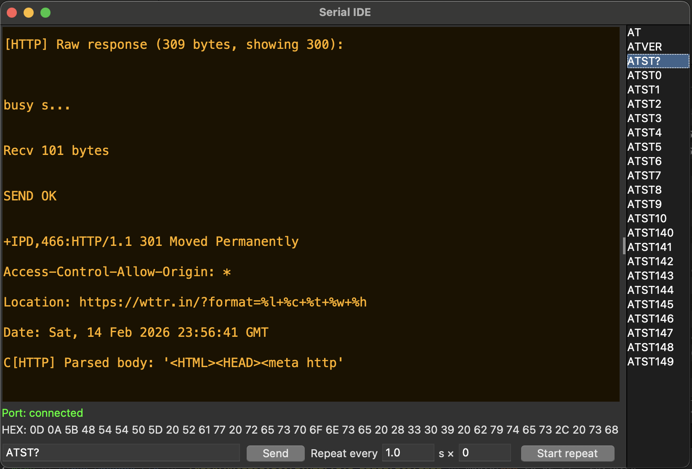
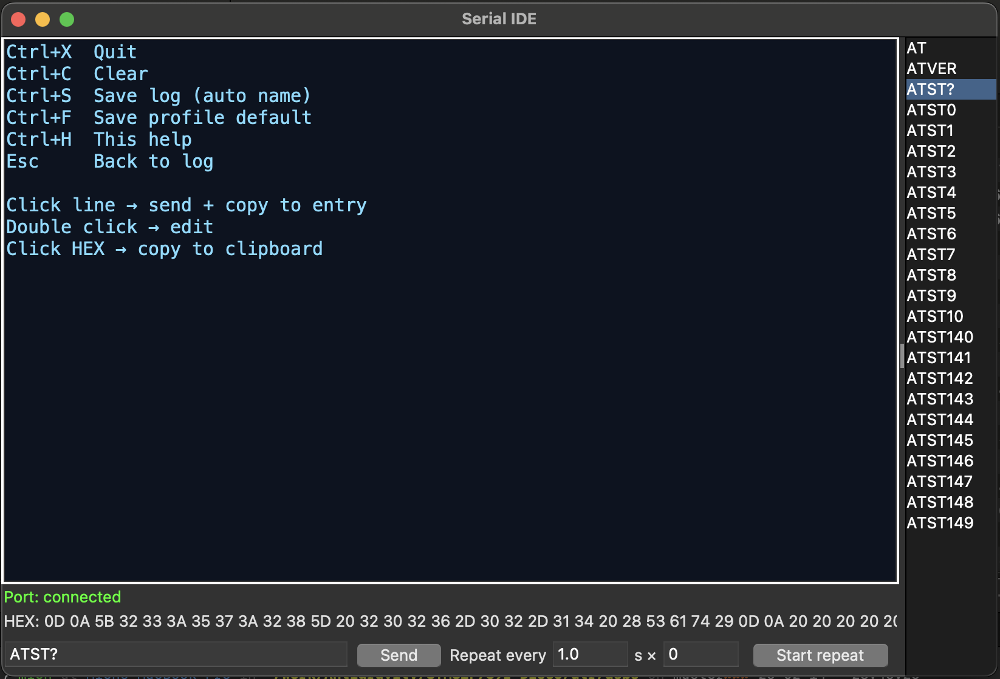
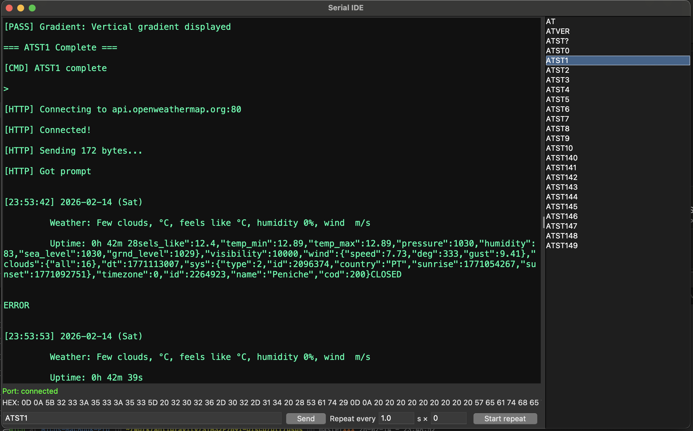
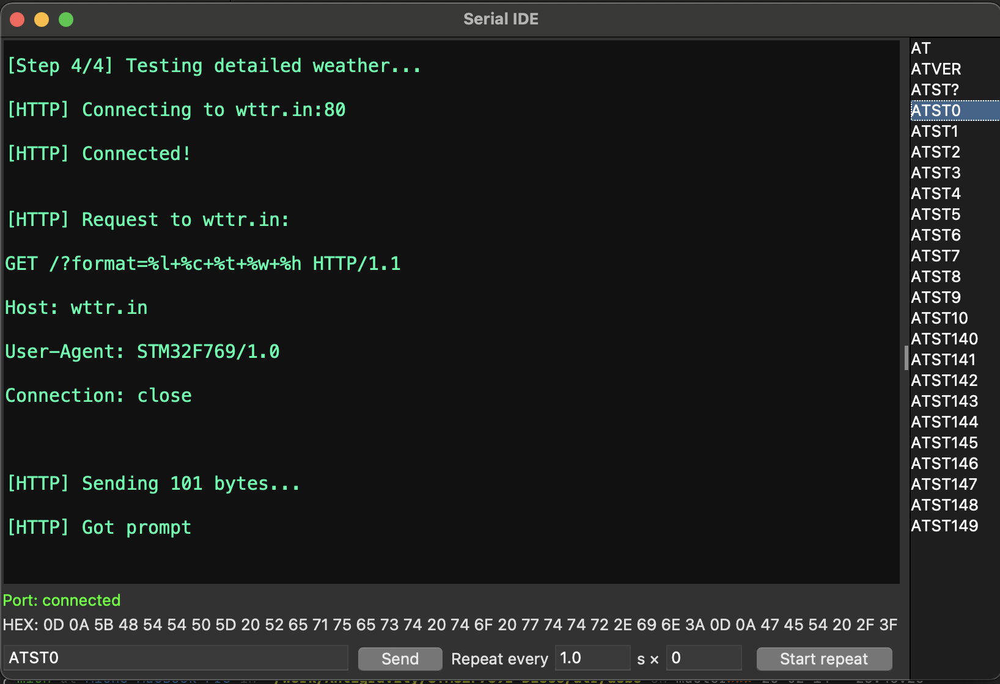

# USB Serial IDE

A powerful yet very lightweight terminal for engineers. Specially tuned for daily work with UART, STM32, ESP, nRF, etc.







## Features

- Hotkeys for everything
- Quick command list (single click = send)
- Repeat transmission with configurable interval and repeat count
- Automatic log saving with nice filename
- Profiles (saves all settings + commands)
- Full tolerance to USB port disconnection
- Dark/light themes
- Virtual mode for debugging

## Hotkeys

| Key           | Action                                           |
|---------------|--------------------------------------------------|
| **Ctrl + X**  | Quit program                                     |
| **Ctrl + B**  | Clear terminal and buffer                        |
| **Ctrl + C**  | Copy selected text to clipboard                  |
|               | automatically copies it to the system clipboard. |
| **Ctrl + F**  | Save default profile                             |
| **Ctrl + H**  | Show this help                                   |
| **Esc**       | Return from help back to log                     |
| **Enter**     | Send command                                     |
| **Click on right panel line** | Send + copy to input field       |
| **Double-click on line**      | Edit command                     |
| **Click on HEX**              | Copy hex string to clipboard     |

Pressing Ctrl + S now not only saves the log to a file, 
but also automatically copies it to the system clipboard.
You can paste it directly (Cmd + V / Ctrl + V) into 
any editor, chat, notes, etc.

## Installation & Run

### Quick Start (macOS)

```bash
# Clone repository
git clone https://github.com/your-username/usbs-serial-ide.git
cd usbs-serial-ide

# Install dependencies
pip install pyserial

# Run using system Python (recommended)
./my_term.py
# or
/usr/bin/python3 my_term.py
```

### Alternative: Using pyenv

If you use pyenv and encounter `ModuleNotFoundError: No module named '_tkinter'`:

```bash
# Install Tcl/Tk via Homebrew
brew install tcl-tk

# Reinstall Python with Tkinter support
PYTHON_CONFIGURE_OPTS="--with-tcltk-includes='-I$(brew --prefix tcl-tk)/include' --with-tcltk-libs='-L$(brew --prefix tcl-tk)/lib'" \
pyenv install 3.14.0

# Set local version
pyenv local 3.14.0

# Install dependencies
pip install pyserial

# Run
./my_term.py
```

### Linux

```bash
# Install system dependencies
sudo apt-get install python3-tk  # Debian/Ubuntu
# or
sudo dnf install python3-tkinter  # Fedora

# Install Python dependencies
pip install pyserial

# Run
python3 my_term.py
```

## Requirements

- **Python**: 3.8+ (3.14+ recommended)
- **pyserial**: `pip install pyserial`
- **tkinter**: Usually included with Python

## Troubleshooting

### `ModuleNotFoundError: No module named '_tkinter'`

This error occurs when Python was compiled without Tkinter support (common with pyenv on macOS).

**Solution 1**: Use system Python (recommended):
```bash
/usr/bin/python3 my_term.py
```

**Solution 2**: Reinstall Python with Tkinter support (see "Alternative: Using pyenv" above).

### `ModuleNotFoundError: No module named 'serial'`

Install pyserial:
```bash
pip install pyserial
```

### Permission denied on `/dev/tty.usb*`

On macOS, you may need to add your user to the `dialout` group or use `sudo` (not recommended).

On Linux:
```bash
sudo usermod -a -G dialout $USER
# Log out and log back in
```