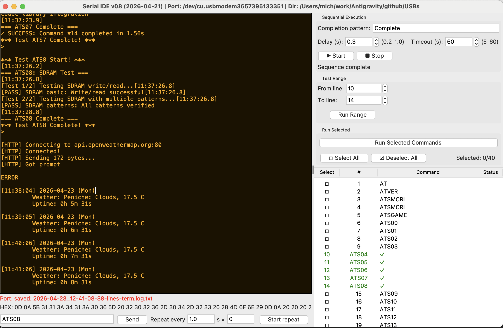
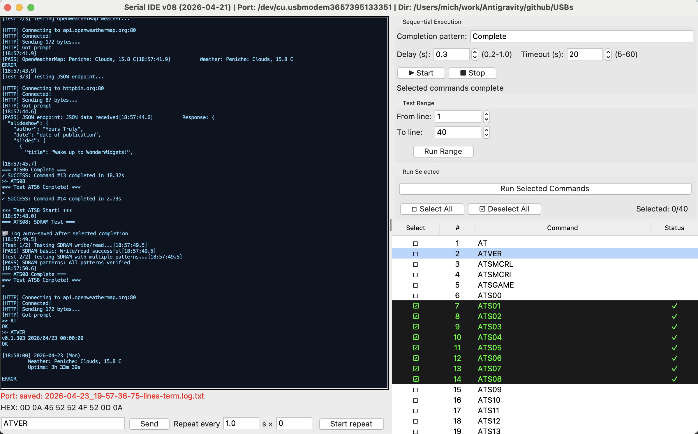
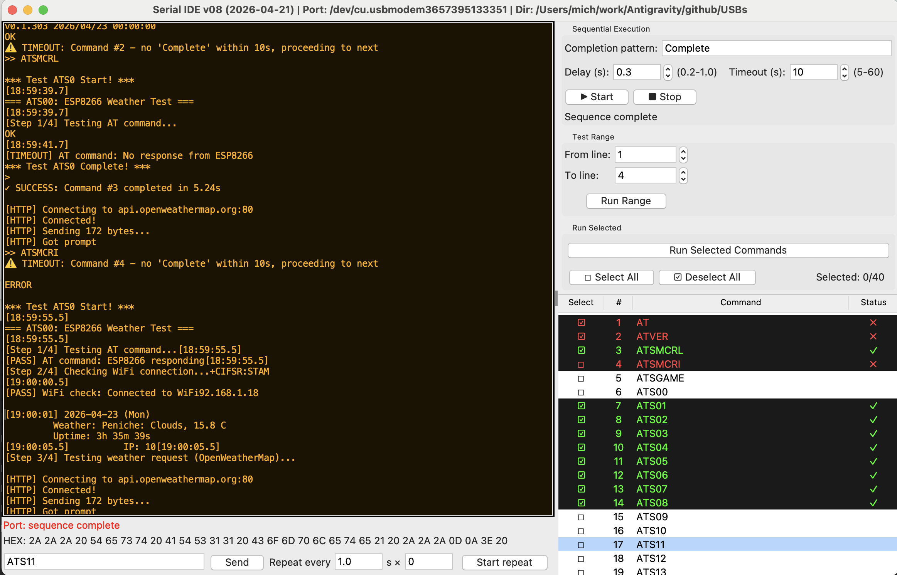

# Serial IDE v08 - Terminal for USB Devices

**Cross-platform Serial Terminal for automated testing with Python 3.8+**

Works on: macOS / Linux / Windows / Termux (Android)







## 🚀 Features

### Core Functionality
- **Serial Communication**: Full pyserial integration with auto-reconnect
- **Command Execution**: Sequential, Repeat, Range, and Selected modes
- **Virtual Mode**: Test without physical hardware
- **Profile System**: Save/Load configurations (4 commands)
- **5 Color Themes**: Dark, Amber, Blue, White-on-Black, White-on-Blue

### Command Management (40 Commands)
- **Select Commands**: Toggle individual command selection
- **Select All/Deselect All**: Batch selection operations
- **Run Selected**: Execute only selected commands
- **Run Range**: Execute commands within a range
- **Status Tracking**: ✓ Success / ✗ Failed with color coding
- **4-Column Display**: Select checkbox, Line number, Command, Status

### Visual Design
- **Selected Rows**: Light green background (#2d4d4d)
- **Success Status**: Green text (#00ff00) on dark background (#1a1a1a)
- **Failed Status**: Red text (#ff4444) on dark background (#1a1a1a)
- **Excellent Readability**: High contrast on all themes

## 📦 Installation

### Prerequisites
```bash
# Python 3.8+ required
python3 --version

# Install pyserial
pip install pyserial
```

### Platform-Specific

#### macOS
```bash
# tk is included with system Python
# Or install with Homebrew:
brew install python-tk
```

#### Linux (Debian/Ubuntu)
```bash
sudo apt-get install python3-tk
```

#### Termux (Android)
```bash
pkg install python-tk
```

#### Windows
```bash
# tkinter is included with Python
# Just install pyserial:
pip install pyserial
```

## 🎯 Quick Start

```bash
# Make executable
chmod +x my23term.py

# Run
./my23term.py
```

### First Use
1. Select serial port or use **VIRTUAL** mode
2. Set baud rate (default: 115200)
3. Load commands from file or enter manually
4. Select execution mode:
   - **Sequential**: Run all commands in order
   - **Repeat**: Repeat one command continuously
   - **Range**: Run commands 1-N
   - **Selected**: Run only selected commands
5. Click **Start** to begin execution

## 🎨 Features in Detail

### Theme Selection
- **dark**: Black background, cyan text (#00FFAA)
- **amber**: Dark brown background, amber text (#FFB000)
- **blue**: Dark blue background, light blue text (#7FDBFF)
- **white_on_black**: Pure black background, white text
- **white_on_blue**: Dark blue background, white text

### Profile System
- **Save Profile**: Save current configuration
- **Save Profile As**: Save with custom name
- **Load Profile**: Load existing profile
- **Load Profile As**: Load from custom location

Profiles stored in: `./profiles/`

### Command Selection
- Click on any command to toggle selection
- **Select All**: Select all 40 commands
- **Deselect All**: Clear all selections
- **Selected counter**: Shows "Selected: X/40"

### Execution Modes

#### Sequential Mode
Execute all commands in sequence with pattern matching:
- Wait for "Start" pattern (default: "Start")
- Wait for "Complete" pattern (default: "Complete")
- Timeout: 10 seconds after Start
- Delay: 0.3 seconds after Complete

#### Repeat Mode
Repeat one command continuously without waiting for response:
- Select command
- Click "Repeat"
- Command executes every 0.5 seconds
- Click "Stop" to halt

#### Range Mode
Execute commands 1 through N:
- Enter range (e.g., "1-10")
- Only commands in range execute
- Pattern matching applies

#### Selected Mode
Execute only selected commands:
- Select commands with checkboxes (☐/☑)
- Click "Run Selected Commands"
- Only selected commands execute
- Pattern matching applies

## 📊 Status Display

After execution:
- ✓ = Success (green text)
- ✗ = Failed (red text)
- Empty = Not executed

**CRITICAL**: Select column (☐/☑) is preserved after status updates, allowing re-selection of commands.

## 🔧 Configuration

### Window Settings
- Window geometry saved automatically
- Restores last position on startup

### EOL Modes
- **No EOL**: Send commands as-is
- **Add \n**: Append newline
- **Add \r\n**: Append carriage return + newline

### Pattern Matching
Customize in `self.cfg`:
```python
self.seq_pattern = cfg.get("seq_pattern", "Complete")  # Pattern to wait for
self.seq_delay = cfg.get("seq_delay", 0.3)              # Delay after match (seconds)
self.seq_timeout = cfg.get("seq_timeout", 10)           # Timeout (seconds)
```

## 📁 File Structure

```
USBs/
├── my23term.py          # Main terminal script
├── profiles/            # Profile storage
│   └── profile_*.json
├── README.md            # This file
└── CHANGELOG.md         # Version history & fixes
```

## 🐛 Troubleshooting

See [CHANGELOG.md](CHANGELOG.md) for detailed fixes and solutions to common issues.

### Common Issues

**Problem**: "tkinter not available"
- **Solution**: Install python-tk for your platform (see Installation)

**Problem**: Cannot select commands after test execution
- **Solution**: This was a bug in v01-v22. **Fixed in v23** - Select column now preserved

**Problem**: Port disconnects frequently
- **Solution**: Enable auto-reconnect (default: 5 attempts, 2s delay)

**Problem**: Commands not executing
- **Solution**: Check pattern matching settings and serial connection

## 📝 Version History

### v08 (Current) - my23term.py
- ✅ **CRITICAL FIX**: Select column preserved after status updates
- ✅ 4-column format: (Select, #, Command, Status)
- ✅ Improved visual design with better colors
- ✅ Profile system (4 commands)
- ✅ Theme menu (5 themes)
- ✅ Repeat mode without response waiting
- ✅ Excellent readability on all platforms

See [CHANGELOG.md](CHANGELOG.md) for complete history.

## 🤝 Contributing

This terminal is actively maintained. Issues and pull requests are welcome.

## 📄 License

MIT License - Feel free to use in your projects!

## 🙏 Acknowledgments

Built with:
- Python 3.8+
- pyserial
- tkinter (cross-platform GUI)
- Community feedback and testing

---

**Made with ❤️ for embedded developers and testers**

For detailed technical information and bug fixes, see [CHANGELOG.md](CHANGELOG.md)
